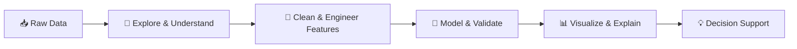

<div align="center">


<br />

<a href="https://github.com/Reinhrd">
  
</a>


</div>

---

## 👋 About Me

I enjoy building data projects that move from **raw data** to **clear insights**, then into models, visualizations, and practical decision support.

My work sits around:

- 📊 **Data analytics & visualization** — exploring patterns and communicating findings clearly.
- 🧠 **Machine learning** — building, evaluating, and improving predictive models.
- ⏱️ **Time series & forecasting** — understanding change over time through data.
- 🐍 **Python workflows** — creating reproducible pipelines, notebooks, and dashboards.
- 📈 **Quantitative research** — testing market and behavioral hypotheses with transparent evaluation.

> **My approach:** understand the data → validate the logic → communicate the result.

---

## 🧭 How I Like to Build



---

## ✨ Areas I Explore

<table>
  <tr>
    <td width="50%" valign="top">
      <h3>📊 Analytics & Dashboards</h3>
      <p>Turning operational data into KPI views, customer insights, and management-ready stories.</p>
    </td>
    <td width="50%" valign="top">
      <h3>🧠 Machine Learning</h3>
      <p>Classification, evaluation, feature engineering, and explainable experimentation.</p>
    </td>
  </tr>
  <tr>
    <td width="50%" valign="top">
      <h3>⏱️ Time Series</h3>
      <p>Forecasting, trend analysis, and structured approaches to temporal data.</p>
    </td>
    <td width="50%" valign="top">
      <h3>📈 Quantitative Research</h3>
      <p>Exploring price-time patterns, volume behavior, and reproducible signal validation.</p>
    </td>
  </tr>
</table>

---

## 🚀 Selected Work

| Project | What it explores | Main tools |
|---|---|---|
| **Smart Workshop Intelligence** | Service reminders, customer prioritization, cross-sell analytics, demand forecasting, and decision-ready reporting for an automotive workshop. | Python, Pandas, Scikit-learn, Forecasting, Excel |
| **NSSS Price-Time Reversal Lab** | A research-oriented workflow for detecting potential turning-point zones using OHLCV data, visibility graphs, volume confirmation, and backtesting. | Python, Time Series, NetworkX, Visualization |
| **Applied ML Classification Projects** | Structured experiments for data cleaning, feature preparation, model training, and evaluation on tabular datasets. | Python, Scikit-learn, TensorFlow |
| **Economic & Energy Time Series** | Exploratory and multivariate analysis of economic indicators, production data, and commodity-price dynamics. | Python, Pandas, Statsmodels |

> 📌 The repositories below are a growing collection of experiments, portfolio projects, and reproducible analytics workflows.

---

## 🛠️ Technologies & Tools

<div align="center">


<br /><br />


</div>

---

## 📈 GitHub Activity

<div align="center">


<br /><br />


</div>

---

## 🐍 Contribution Trail

<div align="center">

<picture>
  <source media="(prefers-color-scheme: dark)" srcset="https://raw.githubusercontent.com/Reinhrd/Reinhrd/output/github-contribution-grid-snake-dark.svg" />
  <source media="(prefers-color-scheme: light)" srcset="https://raw.githubusercontent.com/Reinhrd/Reinhrd/output/github-contribution-grid-snake.svg" />
  
</picture>

</div>

---

## 🌱 Current Direction

```text
Data → Structure → Pattern → Validation → Insight → Decision
```

I am continuously improving how I design projects: keeping the analysis understandable, the workflow reproducible, and the final output useful to real people.

---

<div align="center">


<br />

<sub>Thanks for visiting — feel free to explore my repositories and follow the learning journey.</sub>

</div>
